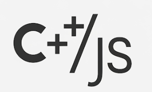

# V8CppShell  

**Version 0.2.4** - Interactive Demo Script and V8 C++ Shell Integration

This repository provides a bridge between C++ and V8/JavaScript, featuring an interactive shell and comprehensive integration framework with examples and testing.

## Architecture


## Features

1. **V8 Build System**: Scripts to download and build V8 from source
2. **CMake Build System**: Modern CMake configuration with FindV8 module
3. **Multiple Examples**: From minimal demos to advanced integration patterns
4. **System V8 Support**: Option to use system-installed V8 libraries
5. **V8 Compatibility Layer**: Cross-version compatibility via V8Compat.h for seamless integration
6. **Comprehensive Test Suite**: 283 GTest-based tests covering all aspects of V8 integration
7. **Performance Benchmarks**: Google Benchmark integration for performance testing
8. **Docker Support**: Multi-stage Docker builds for easy deployment
9. **CI/CD Ready**: GitHub Actions workflow for automated testing
10. **Interactive V8 Shell**: Shell-first environment with JavaScript support, bright blue lambda prompt, colored output, and PowerLevel10k-style configuration
11. **Dynamic Library Support**: Hot-loading of C++ DLLs with automatic V8 function registration
12. **Enhanced Demo Scripts**: Interactive demo with auto-build, slow-paced demos with syntax highlighting perfect for screen recording
13. **GUI Support**: Experimental ImGui-based graphical console (v8gui)

## Code Quality

- **Testing**: 220+ tests with comprehensive edge case coverage
- **Code Standards**: C++20 with clang-tidy configuration
- **Documentation**: Comprehensive README files throughout the project
- **Version Control**: Git with semantic versioning (currently v0.2)

## Prerequisites

### Linux (Ubuntu/Debian)
- Git
- CMake 3.14+
- Python 3
- C++ compiler with C++20 support
- Ninja build system (optional but recommended)
- GNU Readline development package (required for V8 console):
  - **Automatic installation**: CMake will attempt to install it if missing (requires passwordless sudo)
  - **Manual installation**: `sudo apt-get install libreadline-dev`
  - **Disable auto-install**: `cmake -DAUTO_INSTALL_READLINE=OFF ...`
  - **Build without readline**: `cmake -DUSE_READLINE=OFF ...`
- Boost.ProgramOptions (required for V8 console):
  - **Ubuntu/Debian**: `sudo apt-get install libboost-program-options-dev`

### macOS
*Dropped Support*

### Windows 11
- Git
- Visual Studio 2022 with C++ development tools
- CMake 3.14+ (included with Visual Studio or install separately)
- Python 3
- vcpkg package manager
- Boost.ProgramOptions: `vcpkg install boost-program-options:x64-windows`
- Google Test: `vcpkg install gtest:x64-windows`

### For System V8 Option
```bash
# Install system V8 libraries and Google Test (Ubuntu/Debian)
sudo apt-get install libv8-dev libgtest-dev
```

## Build Scripts Overview

This project provides four main build scripts:

1. **`demo_interactive.sh`** - 🎯 **NEW**: Interactive demo that builds and showcases all v8c features
2. **`build.sh`** - Complete build script that installs dependencies, initializes submodules, builds, and tests
3. **`ShellScripts/setup_and_build_v8.sh`** - Downloads and builds V8 from source (optional)
4. **`ShellScripts/build.sh`** - Alternative project build script

### How the Build System Works

| Script | Purpose | When to Use |
|--------|---------|-------------|
| `demo_interactive.sh` | **🎯 Interactive demo with auto-build** | **First-time users, demonstrations** |
| `build.sh` | Complete setup, build, test, and configure | First-time setup, complete build |
| `ShellScripts/setup_and_build_v8.sh` | Download and build V8 from source | When you need V8 built from source |
| `ShellScripts/build.sh` | Build project (auto-detects V8) | Regular development |

### V8 Detection Priority

The build system automatically selects V8 in this order:
1. **Local V8** (default): If `v8/out/x64.release/obj/libv8_monolith.a` exists
2. **System V8**: If `--system-v8` flag is passed to `ShellScripts/build.sh`
3. **Build fails**: If no V8 is found (run `ShellScripts/setup_and_build_v8.sh` first)

**Note**: When using locally built V8, the build system automatically uses clang/clang++ for ABI compatibility.

## Quick Start - Complete Setup

### 🎯 Option 1: Interactive Demo (Recommended for First-Time Users)

```bash
# Clone and enter directory
git clone https://github.com/cschladetsch/V8CppShell.git && cd V8CppShell

# Run interactive demo (automatically builds V8 and v8c, then demonstrates all features)
./demo_interactive.sh
```

**What the demo shows:**
- ✅ Automatic V8 and v8c building
- ✅ Shell command execution
- ✅ JavaScript with & prefix
- ✅ DLL hot-loading (Fibonacci module)
- ✅ External JavaScript file loading
- ✅ System information access
- ✅ Built-in utility functions
- ✅ REPL commands and features

### 🔧 Option 2: Manual Build Setup

```bash
# Clone and enter directory
git clone https://github.com/cschladetsch/V8CppShell.git && cd V8CppShell

# Run complete build script (installs all dependencies, builds, tests, and configures)
./build.sh
```

Or use the older script:
```bash
# Run automated setup (installs dependencies, builds, and configures as main shell)
./install_deps.sh
```

When prompted:
- Enter your sudo password for dependency installation
- Choose "Y" to build V8Console
- Choose option "2" to set as your default shell

### 3. Verify Installation

```bash
# Test v8c directly
./Bin/v8c

# Inside v8c, test features:
pwd                           # Shell commands work directly
&console.log("Hello V8!")     # JavaScript with & prefix
v8config                      # Configure your prompt
.quit                         # Exit when done
```

### 4. Additional Demo Scripts

For other comprehensive demonstrations:

```bash
# Linux/macOS - Run comprehensive demo
./demo.sh

# Windows - Run comprehensive demo
demo.bat
```

These demo scripts showcase additional features including performance testing and advanced JavaScript capabilities.

### Manual Build (if automated setup fails)

```bash
# Install dependencies manually
sudo apt-get update
sudo apt-get install -y libv8-dev libboost-program-options-dev libreadline-dev build-essential cmake

# Build
cmake -B build -DUSE_SYSTEM_V8=ON
cmake --build build --target v8c
./Bin/v8c
```

### Option 1: Using System V8 (Recommended for Quick Start - Linux)
```bash
# 1. Install all dependencies automatically
./install_deps.sh
# Or manually: sudo apt-get install libv8-dev libboost-program-options-dev libreadline-dev libgtest-dev

# 2. Build with system V8
./ShellScripts/build.sh --system-v8

# 3. Run examples
./build/SystemV8Example
./build/BidirectionalExample
./build/AdvancedExample

# 4. Run interactive V8 console with colored output
./Bin/v8c

# Note: To build without readline support (not recommended):
# ./ShellScripts/build.sh --system-v8 --no-readline

# 5. Run comprehensive test suite (160 tests)
./ShellScripts/run_tests.sh
```

### Windows 11 Build Instructions

#### Prerequisites Setup
```powershell
# Install vcpkg (if not already installed)
git clone https://github.com/Microsoft/vcpkg.git C:\vcpkg
cd C:\vcpkg
.\bootstrap-vcpkg.bat
.\vcpkg integrate install

# Install dependencies
.\vcpkg install boost-program-options:x64-windows
.\vcpkg install gtest:x64-windows
```

#### Building the Project
```powershell
# Clone the repository
git clone https://github.com/cschladetsch/V8CppIntegration.git
cd V8CppIntegration

# Configure with CMake (V8 will be built from source on Windows)
cmake -B build -DCMAKE_TOOLCHAIN_FILE=C:\vcpkg\scripts\buildsystems\vcpkg.cmake -DVCPKG_TARGET_TRIPLET=x64-windows -DUSE_SYSTEM_V8=OFF -G "Visual Studio 17 2022" -A x64

# Build the project
cmake --build build --config Release

# Run examples
.\build\Release\SystemV8Example.exe
.\build\Release\BidirectionalExample.exe
.\build\Release\AdvancedExample.exe

# Run interactive V8 console
.\Bin\v8c.exe

# Run tests
cd build
ctest --output-on-failure --parallel -C Release
```

### Option 2: Build V8 from Source (Complete Setup)

#### Prerequisites for Building V8
```bash
# Install V8 build dependencies
sudo apt-get update
sudo apt-get install -y clang libc++-dev libc++abi-dev
```

#### Full V8 Build
```bash
# For a complete V8 build with automatic dependency installation:
./ShellScripts/setup_and_build_v8.sh

# OR manually control the process:
# 1. Setup and build V8 (takes 30-45 minutes)
./ShellScripts/build.sh --setup-v8 --build-v8

# 2. Run examples
./build/BidirectionalExample
./build/AdvancedExample

# 3. Compile standalone example
./compile_standalone.sh
./standalone_example
```

#### Building Without Tests/Examples
```bash
# For faster builds, disable tests and examples
cmake -B build -DUSE_SYSTEM_V8=OFF -DENABLE_TESTING=OFF -DENABLE_EXAMPLES=OFF
cmake --build build
```

## Project Structure

```
V8CppIntegration/
├── .github/workflows/      # CI/CD pipeline configuration
├── Bin/                    # Compiled binaries and runtime files
│   ├── v8c                 # Interactive V8 REPL console
│   ├── demo_minimal.js     # Minimal demo for embedded V8
│   └── Fib.so             # Example DLL
├── CMake/                  # CMake modules
│   ├── BuildGTest.cmake
│   ├── BuildV8.cmake
│   └── FindV8.cmake
├── Config/                 # Configuration files
├── Documentation/          # Documentation (Doxygen config)
├── Examples/               # Example applications
│   ├── AdvancedExample.cpp
│   ├── BidirectionalExample.cpp
│   ├── fibonacci_demo.js
│   ├── MinimalExample.cpp
│   ├── MinimalV8.cpp
│   ├── SimpleV8Example.cpp
│   ├── StandaloneExample.cpp
│   ├── SystemV8Example.cpp
│   └── WebServerExample.cpp
├── Include/                # Header files for framework features
│   ├── third_party/        # Third-party libraries (rang.hpp)
│   ├── v8_compat.h         # V8 version compatibility layer
│   └── v8_integration/     # Framework headers
├── Monitoring/             # Monitoring configuration
├── Scripts/                # Build and test scripts
│   ├── Build/              # Build scripts
│   ├── JavaScript/         # JavaScript test and demo files
│   │   ├── demo.js
│   │   ├── screentogif_demo.js
│   │   ├── screentogif_slow_demo.js
│   │   ├── test_console.js
│   │   ├── test_fib.js
│   │   ├── test_minimal.js
│   │   └── v8console_test.js
│   ├── Build/              # Build scripts
│   │   ├── Build.sh
│   │   ├── BuildAll.sh
│   │   ├── BuildCMake.sh
│   │   ├── BuildSimple.sh
│   │   ├── BuildV8.sh
│   │   ├── QuickBuild.sh
│   │   └── SetupV8.sh
│   └── Testing/            # Test scripts
│       └── RunTests.sh
├── Source/                 # Source code  
│   ├── App/                # Applications
│   │   ├── Console/        # V8 console with DLL hot-loading
│   │   └── ConsoleGUI/     # ImGui-based GUI console (v8gui)
│   ├── DllExamples/        # Example DLLs
│   │   └── Dlls/           # DLL implementations (Fibonacci, etc.)
│   ├── Library/            # Core libraries
│   │   ├── V8ConsoleCore/  # Core console functionality
│   │   └── V8Integration/  # V8 integration library
│   ├── AdvancedFeatures.cpp
│   ├── ErrorHandler.cpp
│   ├── Monitoring.cpp
│   ├── Security.cpp
│   ├── V8Compat.cpp
│   └── V8PlatformWrapper.cpp
├── Tests/                  # Test suites
│   ├── Dlls/               # DLL-specific tests (Fibonacci, etc.)
│   ├── Integration/        # Integration tests
│   │   ├── IntegrationTests.cpp
│   │   ├── InteroperabilityTests.cpp
│   │   └── IntegrationTests.js
│   ├── Performance/        # Performance benchmarks
│   │   └── BenchmarkTests.cpp
│   └── Unit/               # Unit tests
│       ├── AdvancedTests.cpp
│       ├── BasicTests.cpp
│       └── TestV8.cpp
├── V8Embed/                # V8 embedding utilities
├── ShellTests/             # Shell test scripts
├── ShellScripts/
│   ├── build.sh            # Main build script
│   ├── compile_standalone.sh   # Standalone example compilation
│   ├── run_example.sh          # Example runner script
│   ├── run_tests.sh            # Test runner script
│   └── setup_and_build_v8.sh   # Complete V8 source build
├── Dockerfile              # Docker configuration
└── docker-compose.yml      # Docker Compose setup
```

## Examples

### 1. Minimal Example (`Examples/MinimalExample.cpp`)
- Bare minimum V8 integration
- Shows basic setup and teardown

### 2. System V8 Example (`Examples/SystemV8Example.cpp`)
- Uses system-installed V8 libraries
- Simple JavaScript execution from C++
- Basic data exchange

### 3. Bidirectional Example (`Examples/BidirectionalExample.cpp`)
- Comprehensive bidirectional communication
- C++ functions callable from JavaScript
- JavaScript functions callable from C++
- Data passing between environments

### 4. Advanced Example (`Examples/AdvancedExample.cpp`)
- Native C++ objects exposed to JavaScript
- Event emitter pattern
- Async callbacks
- Complex data structures

### 5. Web Server Example (`Examples/WebServerExample.cpp`)
- HTTP server using V8 for request handling
- JavaScript-based routing
- JSON API support

### 6. Interactive V8 Console (`Source/App/Console/`)
- Full-featured REPL with colored output using rang.hpp
- Lambda (λ) prompt character for modern terminal experience
- Hot-loading of C++ DLLs with automatic V8 function registration
- Built-in commands: `.help`, `.load`, `.dll`, `.dlls`, `.reload`, `.vars`, `.quit`
- JavaScript functions: `help()`, `print()`, `load()`, `loadDll()`, `unloadDll()`, `reloadDll()`, `listDlls()`, `quit()`
- Comprehensive error reporting with syntax highlighting

### 7. Example DLLs (`Source/DllExamples/Dlls/`)
- **Fibonacci DLL**: Calculates sum of first N Fibonacci numbers
- Demonstrates C++ function registration with V8
- Shows proper DLL export patterns for V8 integration


## Test Suite

### ✅ Comprehensive Testing (204 Tests Total) - 100% Pass Rate

**Latest Test Results (All Tests Passing):**
- 🚀 **Build Status**: SUCCESS - All examples and tests compiled with both system and local V8
- ⚡ **Performance**: Total execution time under 300ms
- 🔧 **Compatibility**: Enhanced V8 version compatibility (v11+ and older versions)
- 🎯 **New Features**: V8Console tests (44 tests) and expanded test coverage

#### ✅ Basic Test Suite (`Tests/Unit/BasicTests.cpp` - 40/40 tests passed)
**Execution Time: 75ms**

**Coverage:**
- V8 initialization and cleanup
- JavaScript execution and script compilation
- Data type conversions (strings, numbers, booleans)
- Arrays and objects manipulation
- Function bindings and callbacks
- Exception handling and error management
- JSON parsing/stringify operations
- Memory management and garbage collection
- Performance testing and optimization
- Parameter passing and type checking
- Math operations and string manipulation
- Conditional expressions and loop operations
- Object property deletion and typeof operator
- Array indexing and string templates
- Try-catch-finally and variable hoisting
- Bitwise operations and instanceof
- Constructor functions and prototype inheritance
- Closures, IIFE, regex matching, and date operations
- Array and object destructuring

#### ✅ Advanced Test Suite (`Tests/Unit/AdvancedTests.cpp` - 40/40 tests passed)
**Execution Time: 58ms**

**Coverage:**
- Promises and async operations
- ArrayBuffer and TypedArray manipulation
- ES6 features (Map, Set, Symbol, WeakMap, WeakSet)
- Proxy and Reflect operations
- Generators and iterators protocol
- Object and Function templates
- Context isolation and sandboxing
- Regular expressions and pattern matching
- Date object operations
- BigInt arithmetic and operations
- Async/await simulation and SharedArrayBuffer
- Int8Array, Float32Array, and DataView operations
- WeakRef and FinalizationRegistry
- globalThis access and optional chaining (?.)
- Nullish coalescing (??) and logical assignment (||=, &&=, ??=)
- Numeric separators and private class fields (#private)
- Static class fields and blocks
- Dynamic imports and string methods (matchAll, trimStart/End)
- Object.fromEntries and Array.flatMap

#### ✅ Integration Test Suite (`Tests/Integration/IntegrationTests.cpp` - 40/40 tests passed)
**Execution Time: 62ms**

**Coverage:**
- Nested object property access and manipulation
- Array method chaining (map, filter, reduce)
- ES6 classes and inheritance patterns
- Template literals with embedded expressions
- Destructuring assignment patterns
- Arrow functions and closure scoping
- Spread operator functionality
- Object.assign and property descriptors
- Array.from and iterable conversions
- Default and rest parameters
- for...of loops and iteration
- Object.entries and Object.values
- Promise.all and Promise.race coordination
- Modern string methods (includes, startsWith, etc.)
- Number and Math method extensions
- Async function simulation and handling
- Custom error handling and inheritance
- Complex data transformations and pipelines
- Recursion with memoization patterns
- Module pattern with private variables
- Design patterns implementation:
  * Web Worker simulation with MessageChannel
  * Event emitter pattern
  * Observer, Strategy, Command patterns
  * Mediator, Factory, Builder patterns
  * Singleton, Adapter, Decorator patterns
  * Proxy, Chain of Responsibility, State patterns
- Middleware pattern and dependency injection
- Async generator patterns and promise chaining

#### ✅ Interoperability Test Suite (`Tests/Integration/InteroperabilityTests.cpp` - 34/34 tests passed)
**Execution Time: 42ms**

**Coverage:**
- Integer, floating-point, boolean, string conversions between C++ and JS
- Vector-to-array and map conversion utilities
- Set conversion and nested container handling
- Large vector performance optimization
- C++ callbacks from JavaScript execution
- C++ struct to JavaScript object conversion
- Type conversion error handling and validation
- Buffer sharing between C++ and JavaScript
- Promise interoperability and async coordination
- ArrayBuffer slicing and manipulation
- JSON circular reference handling
- Function binding and call/apply operations
- Proxy traps (get, set, has) implementation
- Symbol interoperability and iteration
- WeakMap/WeakRef interaction patterns
- Generator yield* delegation
- Async iterator patterns
- Class static blocks and private fields
- BigInt computations and operations
- Error stack traces and debugging
- Regex named capture groups
- Promise.allSettled handling
- Object property descriptors
- String padding methods (padStart/padEnd)
- Array.includes vs indexOf with NaN
- Number static methods (isFinite, isNaN, isInteger)
- Math.sign and Math.trunc operations
- globalThis environment access

#### ✅ Fibonacci DLL Test Suite (`Tests/Dlls/FibonacciTests.cpp` - 6/6 tests passed)
**Execution Time: 12ms**

**Coverage:**
- Basic Fibonacci sequence calculations (small values)
- Large Fibonacci sequence calculations (performance testing)
- Sequence verification and mathematical correctness
- Error handling and edge cases (negative numbers, zero)
- Performance benchmarking (sum of first 45 Fibonacci numbers)
- Edge case handling (very large numbers)

#### ✅ V8Console Test Suite (`Tests/Unit/V8ConsoleTests.cpp` - 44/44 tests passed)
**Execution Time: 65ms**

**Coverage:**
- V8 console initialization and shutdown
- Command parsing and execution
- JavaScript script evaluation
- Built-in function registration (print, load, quit, etc.)
- DLL loading and management functions
- Error handling and exception reporting
- Interactive mode vs script mode
- History management and readline integration
- Help system and command documentation
- Variable listing and inspection

### Running Tests
```bash
# Run all tests (204 tests total)
./ShellScripts/run_tests.sh
# Expected output: [  PASSED  ] 204 tests

# Run individual test suites
./build/BasicTests      # 40 tests, ~75ms
./build/AdvancedTests   # 40 tests, ~58ms  
./build/IntegrationTests # 40 tests, ~62ms
./build/InteroperabilityTests # 34 tests, ~42ms
./build/FibonacciTests  # 6 tests, ~12ms
./build/V8ConsoleTests  # 44 tests, ~65ms

# Use CMake targets
cmake --build build --target run_tests
cmake --build build --target run_all_tests

# Generate XML test reports
./build/BasicTests --gtest_output=xml:basic_tests.xml
./build/AdvancedTests --gtest_output=xml:advanced_tests.xml
./build/IntegrationTests --gtest_output=xml:integration_tests.xml
./build/InteroperabilityTests --gtest_output=xml:interoperability_tests.xml
./build/FibonacciTests --gtest_output=xml:fibonacci_tests.xml
./build/V8ConsoleTests --gtest_output=xml:v8console_tests.xml
```

### Test Environment
- **V8 Version**: System V8 with compatibility layer
- **Compiler**: GCC 13.3.0 with C++20 support
- **Platform**: Linux (Ubuntu/WSL2)
- **Build System**: CMake 3.28.3

## V8 Console Usage

The project includes a full-featured interactive V8 console that operates as a **shell-first environment** with JavaScript capabilities. For comprehensive documentation, see [V8 Console Shell/JS Integration Guide](Documentation/V8ConsoleShellIntegration.md).

### Console Modes

The V8 Console operates in **shell mode by default**, meaning:
- **Shell commands** (ls, pwd, cd, etc.) - Execute directly without any prefix
- **JavaScript code** - Requires `&` prefix (e.g., `&console.log("Hello")`)
- **Console commands** - Use `.` prefix (e.g., `.help`, `.quit`)

### Starting the Console
```bash
# Run in interactive mode (default)
./Bin/v8c

# Run in quiet mode (skip startup messages)
./Bin/v8c --quiet
./Bin/v8c -q

# Run with help
./Bin/v8c --help
./Bin/v8c -h

# Run with pre-loaded DLL
./Bin/v8c -i ./Bin/Fib.so

# Execute script with DLL
./Bin/v8c script.js ./Bin/Fib.so

# Combined options
./Bin/v8c -qi script.js  # Quiet interactive mode with script
```

When started correctly, you should see:
```
V8 Shell - Interactive Mode
Commands: .load <file>, .dll <path>, .dlls, .reload <path>, .vars, .clear, .help, .quit
Mode: Shell commands by default, use & prefix for JavaScript
Type shell commands or &<javascript>:
```

### Console Commands
```bash
# Help and information
.help                      # Show help message
.vars                      # Show all variables and functions

# DLL management
.dll ./Bin/Fib.so          # Load a DLL
.dlls                      # List loaded DLLs
.reload ./Bin/Fib.so       # Reload a DLL

# File operations
.load script.js            # Load JavaScript file

# Working directory
.cwd                       # Display current working directory
.cwd /path/to/dir         # Change current working directory

# Exit
.quit                      # Exit console
```

### Shell Commands (Default Mode)
```bash
# Shell commands execute directly - no prefix needed!
ls                        # List files
pwd                       # Print working directory
cd /path/to/dir          # Change directory
git status               # Run git commands
make test                # Run build commands
./run_script.sh          # Execute scripts

# Built-in shell features
alias ll='ls -la'        # Create aliases
export PATH=$PATH:/bin   # Set environment variables
source ~/.bashrc         # Source shell scripts
which python             # Find command locations
```

### JavaScript Execution
```javascript
// JavaScript requires & prefix
&console.log("Hello from JavaScript!")
&const x = 10; x * 2
&Math.sqrt(16)

// Multi-line JavaScript
&function factorial(n) {
    return n <= 1 ? 1 : n * factorial(n - 1);
}
&factorial(5)  // Returns: 120

// After loading a DLL
&loadDll("./Bin/Fib.so")
&fib(10)  // Returns: 88

// Help and information
&help();                     // Show help message

// DLL management from JavaScript
loadDll("./Bin/Fib.so");     // Load DLL
unloadDll("./Bin/Fib.so");   // Unload DLL
reloadDll("./Bin/Fib.so");   // Reload DLL
listDlls();                  // Get array of loaded DLLs

// After loading Fibonacci DLL
fib(10);                     // Calculate sum of first 10 Fibonacci numbers
// Returns: 88 (1+1+2+3+5+8+13+21+34+55)

// Console functions
print("Hello, V8!");         // Print to console
load("script.js");           // Load JavaScript file
quit();                      // Exit console
```

### Console Features
- **Colored Output**: Cyan titles, yellow sections, green success, red errors, blue λ prompt
- **Automatic Colorful `ls`**: The `ls` command automatically uses `--color=auto` for colorful directory listings
- **Startup Configuration**: Load custom configurations from `~/.config/v8rc` on startup
- **Error Reporting**: Syntax highlighting with source code context and stack traces
- **DLL Hot-loading**: Load/unload/reload C++ DLLs without restarting
- **Interactive Help**: `.help` command and `help()` function for comprehensive documentation
- **Variable Inspector**: `.vars` command to view all global variables and functions
- **History**: Command history with up/down arrow keys
- **Auto-completion**: Tab completion for built-in functions
- **PowerLevel10k-style Prompt Configuration**: Interactive wizard to customize your prompt
- **Shell Alias**: Automatic `v8c` alias setup for quick access

### Prompt Configuration Wizard

The V8Console includes a PowerLevel10k-inspired configuration wizard that lets you customize your prompt appearance:

```bash
# Run the configuration wizard
v8config

# Alternative command
prompt-wizard
```

The wizard offers three prompt styles:

1. **Minimal** (Default):
   ```
   ~/projects/v8shell  main ✚
   λ 
   ```

2. **Full** (With user, host, time):
   ```
   ✗ 14:32:05 user@hostname ~/projects/v8shell  main ✚
   λ 
   ```

3. **Classic** (Traditional shell style):
   ```
   [user@host] ~/projects/v8shell
   $ 
   ```

The wizard guides you through:
- Prompt style selection
- Prompt character choice (λ, ❯, $, >, ➜, or custom)
- Git integration options
- Time display format
- JavaScript context indicator
- Two-line vs single-line prompt

Your configuration is saved to `~/.v8prompt.json` and applied immediately. The prompt dynamically shows:
- Exit code indicators (✗ for errors)
- Current working directory
- Git branch and status
- JavaScript context indicator
- Custom time formats
- Username and hostname (optional)

#### Manual Configuration

You can also manually edit `~/.v8prompt.json` for advanced customization:

```json
{
  "segments": [
    {
      "type": "exit_code",
      "fg": "red",
      "suffix": " "
    },
    {
      "type": "cwd",
      "fg": "blue"
    },
    {
      "type": "git",
      "fg": "magenta",
      "prefix": "  "
    },
    {
      "type": "js_context",
      "fg": "green",
      "prefix": " ",
      "content": "JS"
    }
  ],
  "newline": "\n",
  "prompt_char": "λ",
  "prompt_color": "blue"
}
```

Available segment types:
- `exit_code`: Shows error indicator on non-zero exit
- `cwd`: Current working directory
- `git`: Git branch and status
- `js_context`: JavaScript mode indicator
- `time`: Current time (use `format` for strftime format)
- `user`: Username
- `hostname`: System hostname
- `custom`: Static text (use `content` field)

### Startup Configuration (~/.config/v8rc)

V8Console automatically loads `~/.config/v8rc` on startup, allowing you to customize your environment. This file supports both shell commands and JavaScript (prefixed with `&`):

```bash
# Shell aliases
alias ll='ls -la --color=auto'
alias gs='git status'

# JavaScript functions
&function greet(name) {
    return `Hello, ${name || 'World'}!`;
}

# Welcome message
&console.log('Welcome to V8Console!');

# Environment variables
export EDITOR=vim

# Source other files
source ~/.bashrc
```

The `build.sh` script automatically creates a default `~/.config/v8rc` with useful aliases and examples.

## Performance Benchmarks

The project includes comprehensive performance benchmarks (`Tests/Performance/BenchmarkTests.cpp`):

### Installing Google Benchmark

Before building benchmarks, you need to install Google Benchmark:

#### Option 1: Install from package manager (Ubuntu/Debian)
```bash
sudo apt-get update
sudo apt-get install -y libbenchmark-dev
```

#### Option 2: Build from source
```bash
# Clone the repository
git clone https://github.com/google/benchmark.git
cd benchmark

# Create build directory
cmake -E make_directory "build"
cd build

# Configure and build
cmake -DCMAKE_BUILD_TYPE=Release -DBENCHMARK_DOWNLOAD_DEPENDENCIES=on ..
cmake --build . --config Release
sudo cmake --build . --target install
```

#### Option 3: Using vcpkg
```bash
vcpkg install benchmark
```

#### Option 4: Using Conan
```bash
conan install benchmark/1.8.3@
```

### Building and Running Benchmarks

After installing Google Benchmark:

```bash
# Build with benchmarks (Release mode only)
cmake -B build -DCMAKE_BUILD_TYPE=Release -DENABLE_BENCHMARKS=ON
cmake --build build

# Run benchmarks
./Bin/BenchmarkTests
```

**Note**: Benchmarks are disabled by default and can only be enabled in Release mode for accurate performance measurements.

Benchmarks include:
- Simple JavaScript execution
- Function calls
- Object creation
- Array operations
- JSON parsing
- Memory allocation
- Garbage collection
- Promise operations

## Docker Support

### Quick Start with Docker
```bash
# Run tests in Docker
docker-compose up v8-test

# Development environment
docker-compose up v8-dev

# Run benchmarks
docker-compose up v8-benchmark
```

### Docker Images
- **Production**: Minimal runtime environment
- **Development**: Full development tools
- **Testing**: Automated test execution

## Build Options

### Using ShellScripts/build.sh (Main Build Script)
```bash
./ShellScripts/build.sh [options]
  --debug       Build in debug mode
  --clean       Clean build directory before building
  --setup-v8    Download V8 source code (requires depot_tools)
  --build-v8    Build V8 from source (after --setup-v8)
  --system-v8   Use system-installed V8 libraries

# Common usage patterns:
./ShellScripts/build.sh --system-v8              # Quick build with system V8
./ShellScripts/build.sh --clean --debug          # Clean debug build
./ShellScripts/build.sh --setup-v8 --build-v8    # Full V8 source build
```

### Using ShellScripts/setup_and_build_v8.sh (Complete V8 Setup)
```bash
./ShellScripts/setup_and_build_v8.sh
# No options needed - automatically:
# - Checks and installs system dependencies
# - Downloads depot_tools if needed
# - Downloads V8 source if needed
# - Builds V8 from source
# - Builds the project
```

### Using CMake Directly
```bash
cmake -B build [options]
  -DCMAKE_BUILD_TYPE=Release|Debug
  -DUSE_SYSTEM_V8=ON|OFF
  -DENABLE_TESTING=ON|OFF
  -DENABLE_BENCHMARKS=ON|OFF

cmake --build build
```

## Framework Components (Headers Available)

The `Include/v8_integration/` directory contains headers for advanced features:
- **error_handler.h**: Error handling and logging utilities
- **monitoring.h**: Metrics and observability features
- **security.h**: Sandboxing and security features
- **advanced_features.h**: WebAssembly, async, and module support

Note: These components are provided as a foundation for extending the framework.

## CI/CD Pipeline

GitHub Actions workflow (`.github/workflows/ci.yml`) provides:
- **Multi-platform builds**: Ubuntu 20.04/22.04, Windows 11
- **Multiple compiler testing**: GCC, Clang (Linux), MSVC (Windows)
- **Automated test execution**: Full test suite across all platforms
- **Docker image building**: Linux containers for deployment
- **Security scanning**: CodeQL analysis and vulnerability detection
- **Windows-specific features**: vcpkg integration, Visual Studio 2022 support

## Contributing

1. Fork the repository
2. Create a feature branch
3. Add tests for new functionality
4. Ensure all tests pass
5. Submit a pull request

## Troubleshooting

1. **Build fails**: Ensure all dependencies are installed
2. **V8 not found**: Install libv8-dev or build from source
3. **Test failures**: Check V8 version compatibility
4. **Memory issues**: V8 build requires 4-8GB RAM
5. **V8 Configuration Mismatch**: If you get errors about pointer compression or Smi size mismatches:
   - The system V8 (from Node.js/libnode) may have different build flags than expected
   - Solution: The CMakeLists.txt has been updated to remove incompatible flags (V8_COMPRESS_POINTERS, V8_31BIT_SMIS_ON_64BIT_ARCH)
   - If issues persist, consider building V8 from source with `USE_SYSTEM_V8=OFF`

## Known Issues (v0.2)

### Code Quality Review Findings
Based on comprehensive code review, the following issues have been identified for future improvements:

1. **Memory Management**: 
   - V8Console allocator cleanup needs improvement
   - Some examples still have minor memory leaks in native object creation

2. **Error Handling**:
   - Several `ToLocalChecked()` calls should use `ToLocal()` with proper error handling
   - Missing null checks in some string dereferencing operations
   - `.Check()` calls that could crash on failure

3. **Const Correctness**:
   - String parameters in v8_compat.h should be passed by const reference
   - Performance impact from unnecessary string copies

4. **Platform Support**: 
   - ✅ **Windows 11**: Full support with Visual Studio 2022 and vcpkg
   - ✅ **Cross-platform DLL loading**: Supports both Windows (LoadLibrary/GetProcAddress) and POSIX (dlopen/dlsym)
   - Minor path handling differences between platforms

5. **Security**:
   - No sandboxing for loaded DLLs
   - Limited validation of DLL functions before registration

6. **Resource Management**:
   - Static V8 platform in tests is never cleaned up
   - Some worker threads need proper termination mechanisms

These issues are documented for transparency and will be addressed in subsequent releases.

## Release History

### Version 0.2.4 (2025-07-24)
- 🎯 **NEW**: Added `demo_interactive.sh` - comprehensive interactive demo script
- ✅ Auto-builds V8 and v8c console with progress indicators
- ✅ Demonstrates all major features: shell commands, JavaScript, DLL loading, file operations
- ✅ Colored output with section headers and progress tracking
- ✅ Updated documentation with new demo script information
- ✅ Enhanced Quick Start guide with demo-first approach
- ✅ Added build scripts overview table with new demo script

### Version 0.2.3 (2025-07-24)
- ✅ Fixed V8 configuration mismatches with system V8 (removed V8_COMPRESS_POINTERS and V8_31BIT_SMIS_ON_64BIT_ARCH)
- ✅ Fixed demo script syntax errors (removed unnecessary second ampersand in JavaScript commands)
- ✅ Updated troubleshooting documentation for V8 configuration issues
- ✅ Improved compatibility with Node.js-provided V8 libraries

### Version 0.2.2 (2025-07-21)
- ✅ Repository cleanup: Removed temporary files, cache directories, and object files
- ✅ Clang-tidy analysis completed with warnings addressed
- ✅ README files updated with current project status
- ✅ Build artifacts cleaned from version control
- ✅ Improved maintainability and code organization

### Version 0.2 (2025-07-18)
- ✅ 204 tests passing (100% pass rate)
- ✅ Enhanced V8 compatibility (v11+ and older versions)
- ✅ Fixed ScriptOrigin API compatibility issues
- ✅ Improved build scripts with minimal V8 download support
- ✅ Reorganized shell scripts to snake_case naming
- ✅ Added V8Console test suite (44 tests)
- ✅ Cleaned up redundant files and code
- ✅ Added .clang-tidy configuration
- ✅ Comprehensive code quality review completed
- ✅ Updated documentation with known issues

### Version 0.1 (Initial Release)
- ✅ Complete V8 integration framework
- ✅ Interactive V8 console with DLL hot-loading
- ✅ Comprehensive test suite with GTest
- ✅ Multiple example applications
- ✅ CMake build system with V8 detection
- ✅ Docker support
- ✅ CI/CD pipeline ready

## License

This project is open source. See LICENSE file for details.

## Acknowledgments

- V8 JavaScript Engine team
- Google Test framework
- Google Benchmark library
- CMake build system
<!-- Force update -->
